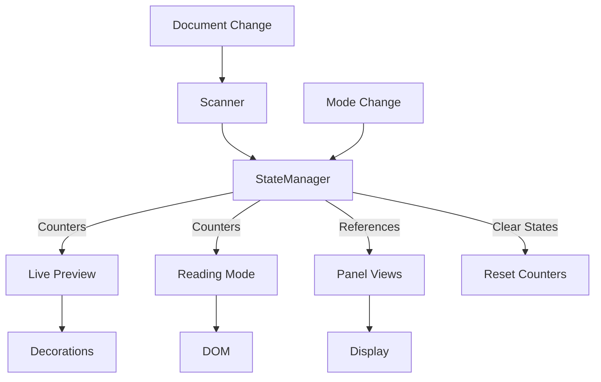

# Academic Pandoc Markdown Plugin Architecture

> Comprehensive technical documentation for the academic-pandoc-markdown plugin. This document helps developers understand existing implementations, debug issues, and extend functionality without duplicating code.

## Table of Contents

1. [Overview](#overview)
2. [Core Architecture](#core-architecture)
3. [Component Inventory](#component-inventory)
4. [Processing Pipeline Details](#processing-pipeline-details)
5. [Implementation Patterns](#implementation-patterns)
6. [Extension Guide](#extension-guide)

## Overview

This plugin extends Obsidian's markdown rendering to support specific academic syntax. It operates in two distinct modes with shared state management:

- **Live Preview Mode**: Real-time syntax transformation using CodeMirror 6 decorations
- **Reading Mode**: Post-processing of rendered HTML using DOM manipulation
- **Export Mode**: Dedicated native TeX/HTML exports via Pandoc with specific Lua filters

### Supported Syntax

| Syntax Type | Examples | Implementation |
|-------------|----------|----------------|
| **Fenced Divs** | `::: {.theorem #id}` with `@id` references | FencedDivProcessor, FencedDivReferenceProcessor |
| **Equations** | `$$ ... % #eq:id $$` with `@eq:id` references | Equation Extractor |
| **Figures** | `![[img\|fig:id]]` with `@fig:id` references | Figure Extractor |
| **Headings** | Hierarchical Numbering | HeadingProcessor |

## Core Architecture

### Design Principles

1. **Two-Phase Processing Pipeline**
   - Phase 1: Structural (block-level) processing
   - Phase 2: Inline (content) processing
   - Clean separation prevents interference between processors

2. **Base Class Hierarchy**
   - `BaseWidget`: Common widget functionality (DOM creation, events, lifecycle)
   - `BaseStructuralProcessor`: Shared structural processor logic (cursor detection, decorations, context)
   - `BasePanelModule`: Shared panel logic (state, updates, rendering)
   - Reduces duplication, ensures consistency

3. **Centralized Configuration**
   - Constants organized in modular structure:
     - `/core/constants.ts`: Main index file (354 lines)
     - `/core/constants/listConstants.ts`: LIST_MARKERS, LIST_TYPES, INDENTATION (35 lines)
     - `/core/constants/cssConstants.ts`: CSS_CLASSES, COMPOSITE_CSS, DECORATION_STYLES (130 lines)
   - All patterns in `ListPatterns` class (`/shared/patterns.ts`)
   - All types in `/shared/types/` directory

4. **State Management**
   - Document-specific: PluginStateManager
   - Processing artifacts: ProcessingContext
   - User preferences: Settings

5. **Feature Flags**
   - Syntax enable/disable state is centralized in `shared/types/settingsTypes.ts`
   - `normalizeSettings()` keeps persisted settings consistent and preserves legacy `moreExtendedSyntax` compatibility
   - `isSyntaxFeatureEnabled()` is the shared gate for live preview, reading mode, editor suggestions, autocompletion, and panel visibility
   - Settings UI groups syntax toggles separately from list auto-completion controls and sidebar panel controls
   - Unordered list marker cycling and source-aware marker rendering are separate settings so keyboard behavior and visual styling can be enabled independently
   - Unordered list marker cycling has a configurable nesting-depth order for `-`, `+`, and `*`
   - Ordered list marker cycling is a keyboard-only setting with a configurable nesting-depth order for supported non-auto ordered markers: decimal, alpha, and roman variants using `.` or `)`

6. **Error Handling**
   - Centralized error handling with `errorHandler.ts`
   - `withErrorBoundary()` for synchronous operations
   - `withAsyncErrorBoundary()` for async operations
   - Consistent error context and recovery patterns

7. **Code Quality Standards**
   - Maximum 400 lines per file
   - Maximum 50 lines per function
   - Import order: External → Types → Constants → Patterns → Utils → Internal
   - All hardcoded values in constants
   - Proper TypeScript types (no `any` without justification)

### Architectural Patterns

| Pattern | Purpose | Implementation |
|---------|---------|----------------|
| **Template Method** | Standardize widget lifecycle | BaseWidget.toDOM() |
| **Strategy** | Select processor per syntax | Processor.canProcess() |
| **Observer** | React to mode changes | StateManager.onModeChange() |
| **Registry** | Extensible content processing | ContentProcessorRegistry |
| **Chain of Responsibility** | Process lines or DOM features sequentially | ProcessingPipeline, ReadingModePipeline |

## Component Inventory

### Live Preview Components

#### Structural Processors (`/live-preview/pipeline/structural/`)

All structural processors extend `BaseStructuralProcessor` which provides:
- `isCursorInMarker()`: Check if cursor is within marker range
- `isInvalidInStrictMode()`: Validate strict mode compliance
- `createLineDecoration()`: Create standard line decorations
- `createContentMarkDecoration()`: Create content area decorations
- `createMarkerReplacement()`: Create marker replacement widgets
- `createContentRegion()`: Define regions for inline processing
- `setListContext()`: Update list context for continuation detection
- `processStandardList()`: Template method for standard list processing

| Processor | Priority | Purpose | Triggers On | Extends |
|-----------|----------|---------|-------------|---------|
| **FencedDivProcessor** | 18 | Render Pandoc fenced div open/content/close lines | unindented `:::` with Pandoc-recognized attributes at block boundaries | BaseStructuralProcessor |
| **HeadingProcessor** | 10 | Adds numbering widgets to headings | `^#{1,5}\s` | StructuralProcessor |

#### Inline Processors (`/live-preview/pipeline/inline/`)

| Processor | Priority | Processes | Regions |
|-----------|----------|-----------|---------|
| **FencedDivReferenceProcessor** | 12 | `@id` → `Class n` for labeled fenced divs, equations, figures | normal, fenced-div-content, list-content, definition-content |

#### Widgets (`/live-preview/widgets/`)

All widgets extend `BaseWidget` which provides:
- `toDOM()`: Template method for rendering
- `applyStyles()`: CSS class application
- `setContent()`: Content insertion
- `setupClickHandler()`: Cursor positioning
- `destroy()`: Cleanup with AbortController

| Widget | Extends | Renders |
|--------|---------|---------|
| **FancyListMarkerWidget** | BaseWidget | `A.`, `i.`, `(a)` markers |
| **HashListMarkerWidget** | BaseWidget | Auto-numbered markers |
| **ExampleListMarkerWidget** | BaseWidget | `(@label)` → `(n)` with tooltip |
| **DuplicateExampleLabelWidget** | BaseWidget | Error styling for duplicates |
| **CustomLabelMarkerWidget** | BaseWidget | `{::LABEL}` processed markers |
| **CustomLabelPartialWidget** | BaseWidget | Partial label rendering |
| **CustomLabelPlaceholderWidget** | BaseWidget | `#a` → number |
| **CustomLabelProcessedWidget** | BaseWidget | Fully processed labels |
| **CustomLabelInlineNumberWidget** | BaseWidget | Inline number replacements |
| **CustomLabelReferenceWidget** | BaseWidget | `{::ref}` with hover preview |
| **DuplicateCustomLabelWidget** | BaseWidget | Error styling for duplicates |
| **DefinitionBulletWidget** | BaseWidget | Definition list bullets |
| **FencedDivHeaderWidget** | BaseWidget | Fenced div label heading, e.g. `Theorem 1` |
| **FencedDivClosingWidget** | BaseWidget | Hidden closing fence placeholder |
| **FencedDivReferenceWidget** | BaseWidget | `@id` → `Class n` with hover content |
| **ExampleReferenceWidget** | BaseWidget | `(@ref)` → `(n)` with hover |
| **SuperscriptWidget** | BaseWidget | Superscript formatting |
| **SubscriptWidget** | BaseWidget | Subscript formatting |

### Reading Mode Components

Reading mode uses a small processor pipeline around rendered preview DOM. The public entrypoint remains `processReadingMode(element, context, config, app?)`; it builds a `ReadingModeContext` and runs the default registry from `/reading-mode/pipeline/registry.ts`.

#### Pipeline Core (`/reading-mode/pipeline/`)

| File | Purpose |
|------|---------|
| **ReadingModePipeline.ts** | Registers processors and runs enabled processors in priority order |
| **types.ts** | Defines `ReadingModeContext`, `ReadingModeProcessor`, `BlockDomProcessor`, `InlineTextProcessor`, and Obsidian app adapter types |
| **registry.ts** | Builds the default processor set and shared context |

`ReadingModeContext` contains the rendered root element, Obsidian post-processor context, preview section and section info, source path, optional full source, processor config, render context, document counters, app adapter, and strict-mode validation lines.

#### Block/DOM Processors (`/reading-mode/pipeline/processors/`)

| Processor | Priority | Purpose |
|-----------|----------|---------|
| **UnorderedListMarkerProcessor** | 20 | Adds or clears source-marker classes on rendered unordered list items |
| **DefinitionListNormalizationProcessor** | 40 | Schedules delayed normalization/rebuild of rendered definition lists, using full source when available |
| **FencedDivBlockProcessor** | 60 | Schedules section-scoped fenced div block rendering |
| **ExtendedListBlockProcessor** | 120 | Preserves existing rendered behavior for hash, fancy, example, and source-backed definition list paragraphs |
| **InlineTextEngineProcessor** | 300 | Runs registered inline processors through the shared text-node replacement engine |
| **CustomLabelListProcessor** | 400 | Runs the existing two-pass custom label list processor after other replacements |

#### Inline Text Processors (`/reading-mode/pipeline/inline/`)

Inline processors report text-node matches and create replacement nodes. They do not walk the DOM themselves; `textReplacementEngine.ts` collects text nodes once, applies shared skip rules, sorts matches, drops overlaps deterministically, and replaces each text node once.

| Processor | Purpose |
|-----------|---------|
| **ExampleReferenceInlineProcessor** | `(@ref)` → resolved example number with tooltip |
| **FencedDivReferenceInlineProcessor** | `@id` → fenced div display label with tooltip |
| **SuperscriptInlineProcessor** | `^text^` → `<sup class="pem-superscript">` |
| **SubscriptInlineProcessor** | `~text~` → `<sub class="pem-subscript">` |
| **CustomLabelReferenceInlineProcessor** | `{::ref}` → processed custom label reference |

The shared inline walker skips code, preformatted blocks, headings, math containers, already rendered spans, fenced div headers, and plugin-rendered references/markers.

#### Legacy Parser Helpers (`/reading-mode/parsers/`)

The parser files remain as feature-specific helpers used by reading-mode processors and tests. They are no longer the reading-mode extension point. New reading-mode behavior should be added as a pipeline processor and registered in `registry.ts`, using parser helpers only when useful.

### Panel Modules (`/views/panels/modules/`)

All panels extend `BasePanelModule` which provides:
- Lifecycle management (activate/deactivate/update)
- State management (containerEl, activeView, abortController)
- Context building (example labels, custom labels)
- Base update flow

| Module | ID | Displays |
|--------|----|---------|
| **TocPanelModule** | toc | Hierarchical numbered headings (H1–H5), click-to-navigate, project indicator |
| **FencedDivPanelModule** | fenced-divs | Block title+number, label, rendered content preview |
| **EquationPanelModule** | equations | Tag label, rendered display math preview |
| **FigurePanelModule** | figures | Figure label and title/description |
| **ExportPanelModule** | export | Format and type selectors for native Pandoc exports |
Modules can inject action buttons into the top bar by implementing the optional `renderActions(actionsEl, activeView)` method. Actions are cleared and re-rendered on every panel switch.

### Editor Extensions

#### List Autocompletion (`/editor-extensions/listAutocompletion/`)

**Modular architecture for keyboard handling:**

```
listAutocompletion/
├── index.ts               # Main export, combines all handlers
├── types.ts               # All interfaces and types
├── handlers/
│   ├── enterHandler.ts    # Enter key logic
│   ├── tabHandler.ts      # Tab/Shift+Tab logic
│   ├── shiftHandlers.ts   # Shift+Enter logic
│   ├── emptyListHandler.ts    # Empty list handling
│   ├── listItemHandler.ts     # New list item creation
│   └── continuationHandler.ts # Continuation lines
└── utils/
    ├── lineInfo.ts        # Line information utilities
    ├── markerDetection.ts # List marker detection
    ├── indentation.ts     # Indentation utilities
    ├── orderedMarkers.ts  # Ordered marker depth cycling
    ├── unorderedMarkers.ts # Unordered marker depth cycling
    └── continuationUtils.ts # Continuation helpers
```

| Component | Purpose | Max Lines |
|-----------|---------|----------|
| **handlers/** | Event-specific keyboard handlers | 135 |
| **utils/** | Reusable utility functions | 83 |
| **types.ts** | All TypeScript interfaces | 52 |
| **index.ts** | Factory function and exports | 23 |

### Shared Components

#### Extractors (`/shared/extractors/`)

| Extractor | Returns | Used By |
|-----------|---------|---------|
| **fencedDivExtractor** | FencedDivPanelItem[] | Fenced div panel, scanner context, LongformProjectManager |
| **equationExtractor** | EquationPanelItem[] | Equation panel, LongformProjectManager, suggester |
| **figureExtractor** | FigureEntry[] | LongformProjectManager, suggester, reference processor |
| **sectionExtractor** | SectionEntry[] | TOC panel, LongformProjectManager |
| **exampleListExtractor** | ExampleListItem[] | Panels, context building |
| **customLabelExtractor** | CustomLabel[] | Panels, processing |
| **definitionListExtractor** | DefinitionListItem[] | Definition panel |
| **footnoteExtractor** | FootnotePanelItem[] | Footnote panel, cursor positioning |

### Longform Project Manager (`/core/state/longformProjectManager.ts`)

Singleton that provides cross-file awareness for multi-file writing projects using the [Longform plugin](https://github.com/kevboh/longform).

#### Project Detection

```
File opened → checkAndLoadProjectForFile(file)
  └─ Walk parent directories looking for Index.md with `longform` frontmatter
     └─ Parse YAML directly (metadataCache can lag)
        └─ Extract frontmatter.longform.scenes → flatten nested arrays
           └─ Match scene basenames to TFile paths
              └─ Register file→project mappings
```

#### Cache Architecture

| Cache Map | Key | Value | Purpose |
|-----------|-----|-------|---------|
| `projectScenes` | directory path | ordered file paths | Scene ordering |
| `fileToProject` | file path | directory path | Reverse lookup |
| `fileDivCache` | file path | FencedDivProjectEntry[] | Per-file block data |
| `fileEquationCache` | file path | EquationPanelItem[] | Per-file equation data |
| `fileFigureCache` | file path | FigureEntry[] | Per-file figure data |
| `fileSectionCache` | file path | SectionEntry[] | Per-file heading data |
| `globalLabelIndex` | label string | FencedDivProjectEntry | Global block lookup |
| `globalEquationIndex` | `eq:label` string | EquationPanelItem | Global equation lookup |
| `globalFigureIndex` | `fig:label` string | FigureEntry | Global figure lookup |

#### Numbering Engine

`recalculateNumbering(projectPath)` runs after any cache update:

1. **Blocks**: Iterates scenes in index order. Per class (theorem, definition, …), increments a counter. Sets `projectIndex` and `displayTitle` (e.g., "Theorem 3").
2. **Sections**: Collects all `SectionEntry` across scenes, calls `numberSections()` for hierarchical numbering (1, 1.1, 1.2.1, …). H6 is excluded.
3. **Figures**: Collects all `FigureEntry` across scenes, calls `numberFigures()` for sequential numbering (Figure 1, Figure 2, …).

#### Persistent Cache

`.pem-cache.json` in the project directory stores `files`, `equations`, `sections`, and `figures` keyed by file path. Written with 5-second debounce (`debouncedSave`). Loaded on project scan to avoid re-parsing unchanged files (compares `mtime`).

#### Event Listeners

| Event | Handler |
|-------|---------|
| `metadataCache.changed` on `Index.md` | Re-scan project |
| `metadataCache.changed` on scene file | Re-extract + recalculate |
| `vault.delete` on scene file | Remove from cache + recalculate |
| `vault.rename` on scene file | Update paths in cache |

### Reference Resolution Pipeline

When the user types `@label` and it's not being edited (cursor outside):

```
FencedDivReferenceProcessor.findMatches()
  └─ Match /@([^\s,;)\]}]+)/g in content regions
     └─ resolveLabel(rawLabel, localLabels)
        ├─ eq:* → check globalEquationIndex → always resolve
        ├─ fig:* → check globalFigureIndex → always resolve
        ├─ Global label index → resolve
        ├─ Local labels map → resolve
        └─ Trailing punctuation strip → retry

FencedDivReferenceProcessor.createDecoration()
  ├─ eq:* → displayName = "(eq:label)", content = LaTeX
  ├─ fig:* → displayName = "Figure N", content = description
  └─ block → displayName = "Theorem N", content = block text
      └─ FencedDivReferenceWidget with cmd+hover preview
```

### Suggester Architecture

`FencedDivReferenceSuggest` extends Obsidian's `EditorSuggest`:

1. **Trigger**: `@` character not preceded by `(`
2. **Sources** (in order):
   - Local fenced divs (scanned from current editor content)
   - Global fenced divs (from `LongformProjectManager.getAllReferences()`)
   - Local equations (extracted from current content)
   - Global equations (from `getAllEquationReferences()`)
   - Local figures (extracted from current content)
   - Global figures (from `getAllFigureReferences()`)
3. **Matching**: Fuzzy matching — all query chars must appear in order in the target
4. **Sorting**: Exact prefix → substring → dispersed fuzzy → alphabetical
5. **Rendering**: Two-column layout — `@tag` + filename (left), content preview (right)

### Hover Preview System

`setupRenderedHoverPreview()` in `hoverPopovers.ts`:

- **Trigger**: `mousemove` with `metaKey` (Cmd on Mac)
- **Rendering**: Uses `MarkdownRenderer.render()` for full markdown+math
- **Positioning**: Auto-adjusts for screen overflow (bottom and right edges)
- **Cleanup**: AbortController-based, with generation tracking for race conditions
- **Lifecycle**: Popover removed on mouse leave with cleanup delay

### Section Indexing (Table of Contents)

`sectionExtractor.ts` parses H1–H5 headings. H6 is explicitly excluded (reserved for paragraphs).

`numberSections(entries)` assigns hierarchical numbers using level-based counters:

```
# Chapter One           → 1
## Section A            → 1.1
## Section B            → 1.2
### Subsection B.1      → 1.2.1
# Chapter Two           → 2
## Section C            → 2.1
```

In Longform projects, sections are collected across all scenes in index order and numbered globally. The `TocPanelModule` renders them with indentation and font-weight based on depth, with click-to-navigate support (opening cross-file scenes as needed).

#### Utilities (`/shared/utils/`)

| Utility | Purpose | Used For |
|---------|---------|----------|
| **errorHandler** | Centralized error handling | All try-catch blocks |
| **mathRenderer** | LaTeX → Unicode conversion | Panel displays |
| **hoverPopovers** | Hover preview creation | References, tooltips |
| **contentTruncator** | Smart content truncation | Panel displays |
| **listHelpers** | List manipulation | Autocompletion |
| **placeholderProcessor** | Process `#a`, `#b` | Custom labels |
| **cursorUtils** | Cursor position calculations | Inline processors |
| **contextUtils** | Reference context building | Inline processors, widgets |

#### Reading Mode Utilities (`/reading-mode/utils/`)

| Utility | Purpose | Used For |
|---------|---------|----------|
| **domUtils** | DOM traversal helpers | Reading mode processors and parser helpers |
| **definitionListBlocks** | Source block extraction helpers | Definition list normalization |
| **definitionListDom** | Rendered DOM normalization helpers | DefinitionListNormalizationProcessor |

## Processing Pipeline Details

### Live Preview Processing Flow

#### Phase 0: Context Building
```typescript
1. Code Region Detection
   - Identify code blocks: ```...```
   - Identify inline code: `...`
   - Mark regions to skip

2. Document Scanning
   - Extract example labels → Map<label, number>
   - Extract custom labels → Map<label, processed>
   - Extract labeled fenced divs → Map<label, display metadata>
   - Skip code regions

3. Validation (Strict Mode)
   - Check Pandoc compliance
   - Mark invalid lines

4. State Retrieval
   - Get hash counter
   - Get definition state
   - Get placeholder context
```

#### Phase 1: Structural Processing
```typescript
For each line (top to bottom):
  1. Skip if in code block
  2. Try processors by priority:
     - HashListProcessor (10)
     - CustomLabelProcessor (15)
     - FencedDivProcessor (18)
     - FancyListProcessor (20)
     - DefinitionProcessor (20)
     - StandardListProcessor (25)
     - ExampleListProcessor (30)
     - ListContinuationProcessor (100)
  3. First matching processor:
     - Creates structural decorations
     - Marks content regions
     - Updates state/counters
     - Can skip further processing
```

#### Phase 2: Inline Processing
```typescript
For each content region from Phase 1:
  1. All processors find matches:
     - ExampleReferenceProcessor
     - FencedDivReferenceProcessor
     - SuperscriptProcessor
     - SubscriptProcessor
     - CustomLabelReferenceProcessor
  2. Filter overlapping matches
  3. Skip matches in code regions
  4. Create decorations for valid matches
  5. Check cursor position (avoid replacing during edit)
```

#### Decoration Assembly
```typescript
1. Combine structural + inline decorations
2. Sort by position
3. Validate document bounds
4. Build RangeSet
5. Return to CodeMirror
```

### Reading Mode Processing Flow

```typescript
1. Obsidian calls processReadingMode(element, context, config, app?)
2. createReadingModeContext() builds one shared context:
   - rendered root element and preview section
   - source path and section info
   - ProcessorConfig and RenderContext
   - document counters and label maps from PluginStateManager
   - strict-mode validation lines
3. createDefaultReadingModePipeline() registers block and inline processors
4. ReadingModePipeline runs enabled processors by priority:
   - source-aware marker classes
   - delayed definition list normalization
   - section-scoped fenced div rendering
   - extended list paragraph rendering
   - shared inline text replacement
   - custom label list post-pass
5. Processors own any required scheduling or source lookup
6. Idempotency is enforced with processed-element state and inline skip rules
```

### State Management Flow



## Implementation Patterns

### Pattern 1: Adding a Live Preview List Type

**Already Implemented**: FancyListProcessor, ExampleListProcessor, CustomLabelProcessor

```typescript
// 1. Create processor extending BaseStructuralProcessor
class NewListProcessor extends BaseStructuralProcessor {
    name = 'new-list';
    priority = 25;

    canProcess(line: Line, context: ProcessingContext): boolean {
        // Check your pattern
        return /your-pattern/.test(line.text);
    }

    process(line: Line, context: ProcessingContext): StructuralResult {
        // Option A: Use the template method for standard lists
        const widget = new YourWidget(/* params */);
        return this.processStandardList(
            line, context, markerStart, markerEnd,
            contentStart, widget, 'new-list', listLevel
        );

        // Option B: Custom processing with base methods
        const decorations = [];
        decorations.push(this.createLineDecoration(line));
        if (!this.isCursorInMarker(start, end, context)) {
            decorations.push(this.createMarkerReplacement(start, end, widget));
        }
        // ... etc
    }
}

// 2. Create widget extending BaseWidget
class NewListWidget extends BaseWidget {
    protected applyStyles(element: HTMLElement): void {
        element.className = 'your-classes';
    }

    protected setContent(element: HTMLElement): void {
        // Set your content
    }
}

// 3. Register in extension.ts
pipeline.registerStructuralProcessor(new NewListProcessor());
```

### Pattern 2: Adding Live Preview Inline Syntax

**Already Implemented**: ExampleReferenceProcessor, SuperscriptProcessor

```typescript
// 1. Create inline processor
class NewInlineProcessor implements InlineProcessor {
    supportedRegions = new Set(['list-content', 'definition-content']);

    findMatches(text: string, region: ContentRegion, context: ProcessingContext) {
        // Find your syntax
        // Check cursor position to avoid edit interference
        // See ExampleReferenceProcessor for pattern
    }
}

// 2. Register in extension.ts
pipeline.registerInlineProcessor(new NewInlineProcessor());
```

### Pattern 2b: Adding Reading Mode Syntax

Reading mode has its own processor interface because it works against rendered DOM and partially available source text, not CodeMirror document offsets.

```typescript
// 1. Create a block/DOM processor when the syntax changes structure
class NewReadingBlockProcessor implements BlockDomProcessor {
    name = 'new-reading-block';
    phase = 'block';
    priority = 150;

    isEnabled(context: ReadingModeContext): boolean {
        return context.config.enableYourFeature !== false;
    }

    process(context: ReadingModeContext): void {
        // Read context.element, context.sectionInfo, context.counters, etc.
        // Own any delayed scheduling here if Obsidian rendering is not settled.
    }
}

// 2. Or create an inline text processor when the syntax replaces text nodes
class NewReadingInlineProcessor implements InlineTextProcessor {
    name = 'new-reading-inline';
    phase = 'inline';
    priority = 350;

    findMatches(text: string, node: Text, context: ReadingModeContext): InlineTextMatch[] {
        // Return non-overlapping candidate ranges relative to this text node.
    }

    createReplacement(match: InlineTextMatch, context: ReadingModeContext): Node {
        // Return a DOM node or nodes. The shared engine handles replacement.
    }
}

// 3. Register in /reading-mode/pipeline/registry.ts
pipeline.registerProcessor(new NewReadingBlockProcessor());

const inlineProcessors = [
    // ...
    new NewReadingInlineProcessor()
];
```

Keep reading-mode processors DOM/source-oriented. Do not port CodeMirror decorations, document offsets, or cursor editing behavior into reading mode.

### Pattern 3: Adding a Panel Module

**Already Implemented**: ExampleListPanelModule, CustomLabelPanelModule

```typescript
// 1. Extend BasePanelModule
class NewPanelModule extends BasePanelModule {
    id = 'new-panel';
    displayName = 'New Panel';
    icon = ICONS.NEW_ICON;

    private data: YourDataType[] = [];

    protected extractData(content: string): void {
        this.data = extractYourData(content);
    }

    protected renderContent(activeView: MarkdownView): void {
        // Render your content
        // See ExampleListPanelModule for pattern
    }

    protected cleanupModuleData(): void {
        this.data = [];
    }
}

// 2. Register in ListPanelView.ts
const module = new NewPanelModule(this.plugin);
availablePanels.push({...});
```

### Pattern 4: Cross-Reference Processing

**Already Implemented**: Example references, Custom label references

```typescript
// Pattern: Build context → Process references → Update display
1. Extract labels during scanning
2. Build Map<label, value> in context
3. Processors use context to resolve references
4. Panels use context for hover previews
```

### Pattern 5: Modular File Organization

**Already Implemented**: listAutocompletion module, CustomLabelProcessor

**Pattern for breaking down large files (>400 lines):**

```typescript
// Example 1: listAutocompletion refactoring
// Original: single file with all handlers
// Refactored:
listAutocompletion/
├── index.ts        # Main export (23 lines)
├── types.ts        # Interfaces (52 lines)
├── handlers/       # Event handlers
│   └── *.ts       # Each <135 lines
└── utils/          # Utilities
    └── *.ts       # Each <83 lines

// Example 2: CustomLabelProcessor refactoring
// Original: CustomLabelProcessor.ts (513 lines)
// Refactored:
CustomLabelProcessor.ts  # Main processor (91 lines)
customLabel/
├── types.ts        # Interfaces (35 lines)
├── parser.ts       # Parsing logic (112 lines)
└── decorations.ts  # Decoration creation (275 lines)

// Example 3: constants.ts refactoring
// Original: constants.ts (484 lines)
// Refactored:
constants.ts        # Main index (354 lines)
constants/
├── listConstants.ts  # List-related (35 lines)
└── cssConstants.ts   # CSS classes (130 lines)
```

**Refactoring Techniques Applied:**
- **Extract Method**: Break large functions into smaller focused ones
- **Extract Module**: Move related functions to separate files
- **Single Responsibility**: Each file has one clear purpose
- **Preserve Behavior**: All tests pass after refactoring

### Pattern 6: Error Handling

**Standard Pattern**: Use centralized error handling utilities

```typescript
// For synchronous operations
import { withErrorBoundary } from '../shared/utils/errorHandler';

function myFunction() {
    return withErrorBoundary(() => {
        // Your code here
        return result;
    }, fallbackValue, 'operation context');
}

// For asynchronous operations
import { withAsyncErrorBoundary } from '../shared/utils/errorHandler';

async function myAsyncFunction() {
    return await withAsyncErrorBoundary(async () => {
        // Your async code here
        return await result;
    }, fallbackValue, 'async operation context');
}
```

## Extension Guide

### Where to Add Features

| Feature Type | Location | Extend/Implement | Register In |
|--------------|----------|------------------|-------------|
| Live preview list syntax | `/live-preview/pipeline/structural/` | StructuralProcessor | extension.ts |
| Live preview inline formatting | `/live-preview/pipeline/inline/` | InlineProcessor | extension.ts |
| Live preview reference type | `/live-preview/pipeline/inline/` | InlineProcessor | extension.ts |
| Widget display | `/widgets/` | BaseWidget | Used by processor |
| Panel content | `/panels/modules/` | BasePanelModule | ListPanelView.ts |
| Data extraction | `/shared/extractors/` | Function | Used by panels |
| Reading mode block behavior | `/reading-mode/pipeline/processors/` | BlockDomProcessor | reading-mode/pipeline/registry.ts |
| Reading mode inline behavior | `/reading-mode/pipeline/inline/` | InlineTextProcessor | reading-mode/pipeline/registry.ts |

### Common Tasks

#### Task: Support a New List Marker Style
1. Check `FancyListProcessor` - it likely already handles it
2. If not, add pattern to `ListPatterns.FANCY_LIST`
3. Gate it through `isSyntaxFeatureEnabled()` if it should be user-toggleable
4. Test with `tests/unit/processors/structural/FancyListProcessor.spec.ts`

#### Task: Add Hover Preview to Something
1. Use `setupRenderedHoverPreview()` from `hoverPopovers.ts`
2. Pass context with label maps
3. See `CustomLabelReferenceWidget` for example

#### Task: Process Content with Math
1. Use `renderContentWithMath()` from `viewInteractions.ts`
2. It handles markdown, math, and references
3. See panel modules for examples

#### Task: Add New Panel Tab
1. Extend `BasePanelModule`
2. Implement `extractData()` and `renderContent()`
3. Optionally implement `renderActions()` for top-bar toggle buttons
4. Register in `ListPanelView.initializePanels()`
5. Add icon to `constants.ts`
6. Add CSS classes to `styles.css`

#### Task: Add a New Extractable/Referenceable Type
1. Create `src/shared/extractors/myTypeExtractor.ts` with `extractMyType()` and `numberMyType()`
2. Add cache maps (`fileMyTypeCache`, `globalMyTypeIndex`) and getters to `LongformProjectManager`
3. Call extractor in `updateFileCache()`, numberer in `recalculateNumbering()`
4. Update `persistProjectCache()`, `loadProjectCache()`, and `forceReload()` for the new cache key
5. Add to `FencedDivReferenceSuggest.getSuggestionsInternal()` for autocomplete
6. Add prefix handling to `FencedDivReferenceProcessor.resolveLabel()` and `createDecoration()`
7. Optionally create a panel module

---

## Quick Reference

### File Map
```
/core/main.ts             → Plugin entry, lifecycle
/core/settings.ts         → User preferences
/core/state/
  pluginStateManager.ts   → Per-document state (counters, labels)
  longformProjectManager.ts → Global project state (caching, numbering)
/core/constants.ts        → Constants index file
/core/constants/
  listConstants.ts        → List markers, types, indentation
  cssConstants.ts         → CSS classes, styles
/editor-extensions/
  /suggestions/           → @ autocomplete with fuzzy matching
/live-preview/            → CodeMirror integration
  /pipeline/              → Two-phase processing
    /structural/          → Block-level processors
    /inline/              → Inline processors (references, sup/sub)
  /widgets/               → DOM decorations
  /scanners/              → Content scanning
  /validators/            → Strict mode validation
/reading-mode/            → Post-processing
  /pipeline/              → DOM/source processor pipeline
    /processors/          → Block and orchestration processors
    /inline/              → Inline text processors
  /parsers/               → Feature parser helpers
  /utils/                 → DOM utilities
/views/panels/            → Sidebar panels
  ListPanelView.ts        → Panel host (tabs, top bar, actions)
  /modules/               → Panel tab implementations
    BasePanelModule.ts    → Abstract base class
    TocPanelModule.ts     → Table of Contents
    FencedDivPanelModule.ts → Block listing
    EquationPanelModule.ts  → Equation listing
/shared/                  → Cross-mode utilities
  /extractors/            → Content extraction
    fencedDivExtractor.ts → ::: blocks
    equationExtractor.ts  → $$ blocks with labels
    figureExtractor.ts    → ![[...|fig:label]]
    sectionExtractor.ts   → Headings (H1–H5)
  /utils/                 → Shared utilities
  /patterns.ts            → All regex patterns
  /rendering/             → Content processing registry
  /types/                 → Shared type definitions
```

### Key Interfaces
```typescript
interface StructuralProcessor {
    canProcess(line: Line, context: ProcessingContext): boolean;
    process(line: Line, context: ProcessingContext): StructuralResult;
}

interface InlineProcessor {
    findMatches(text: string, region: ContentRegion, context: ProcessingContext): InlineMatch[];
    createDecoration(match: InlineMatch, context: ProcessingContext): Decoration;
}

interface PanelModule {
    onActivate(containerEl: HTMLElement, activeView: MarkdownView | null): void;
    onUpdate(activeView: MarkdownView | null): void;
    renderActions?(actionsEl: HTMLElement, activeView: MarkdownView | null): void;
}

interface ReadingModeProcessor {
    name: string;
    phase: 'setup' | 'block' | 'inline' | 'cleanup';
    priority: number;
    isEnabled?(context: ReadingModeContext): boolean;
    process(context: ReadingModeContext): void;
}

interface InlineTextProcessor extends ReadingModeProcessor {
    phase: 'inline';
    findMatches(text: string, node: Text, context: ReadingModeContext): InlineTextMatch[];
    createReplacement(match: InlineTextMatch, context: ReadingModeContext): Node | Node[];
}
```

### Testing
- **Unit tests**: `/tests/unit/` - Mock dependencies
- **Integration tests**: `/tests/integration/` - Component interaction
- **E2E tests**: `/tests/e2e/` - Real Obsidian environment

### Code Standards Summary
- **File Size**: Maximum 400 lines (split larger files into modules)
- **Function Size**: Maximum 50 lines (use Extract Method pattern)
- **Import Order**: External → Types → Constants → Patterns → Utils → Internal
- **Constants**: All hardcoded values must be in constants files
- **Type Safety**: Avoid `any` type; use proper TypeScript interfaces
- **Naming**: PascalCase for classes/interfaces, camelCase for functions/variables, UPPER_SNAKE_CASE for constants

---

*This is a living document. Update it when adding significant features or changing architecture.*
